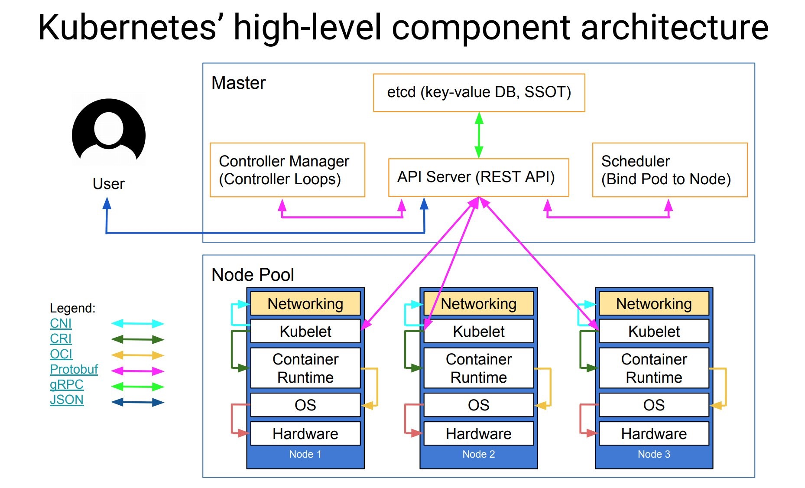

## Kubernetes Components Architecture


## K8s key Components

Kubernetes 主要由以下几个核心组件组成:

etcd 保存了整个集群的状态；
API Server 提供了资源操作的唯一入口，并提供认证、授权、访问控制、API 注册和发现等机制；
Controller Manager 负责维护集群的状态，比如故障检测、自动扩展、滚动更新等；
Scheduler 负责资源的调度，按照预定的调度策略将 Pod 调度到相应的机器上；
Kubelet 负责维护容器的生命周期，同时也负责 Volume（CVI）和网络（CNI）的管理；
Container Runtime 负责镜像管理以及 Pod 和容器的真正运行（CRI）；
Kube-proxy 负责为 Service 提供 cluster 内部的服务发现和负载均衡；

## Useful commands

Create a Deployment based on the YAML file:
```
kubectl apply -f https://k8s.io/examples/application/deployment.yaml
```
Display information about the Deployment:
```
kubectl describe deployment nginx-deployment
```
List the Pods created by the deployment:
```
kubectl get pods -l app=nginx
```

Display information about a Pod:
```
kubectl describe pod <pod-name>
```
Delete the deployment by name:
```
kubectl delete deployment nginx-deployment
```
## YAML example 

```
apiVersion: apps/v1
kind: Deployment
metadata:
  name: nginx-deployment
spec:
  selector:
    matchLabels:
      app: nginx
  replicas: 2 # tells deployment to run 2 pods matching the template
  template:
    metadata:
      labels:
        app: nginx
    spec:
      containers:
      - name: nginx
        image: nginx:1.14.2
        ports:
        - containerPort: 80
```
